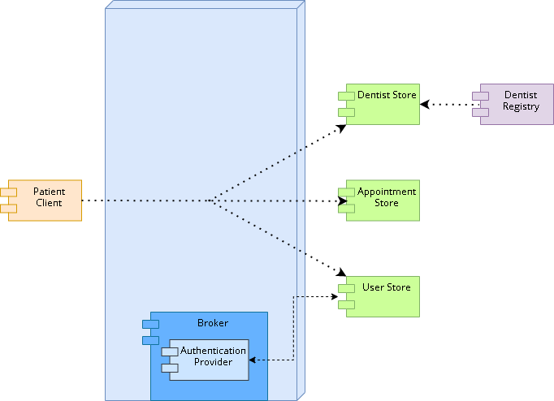
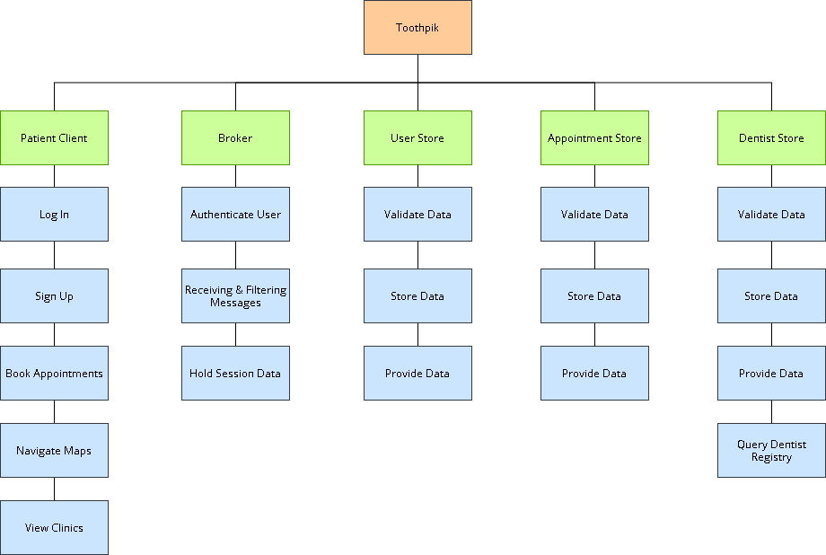
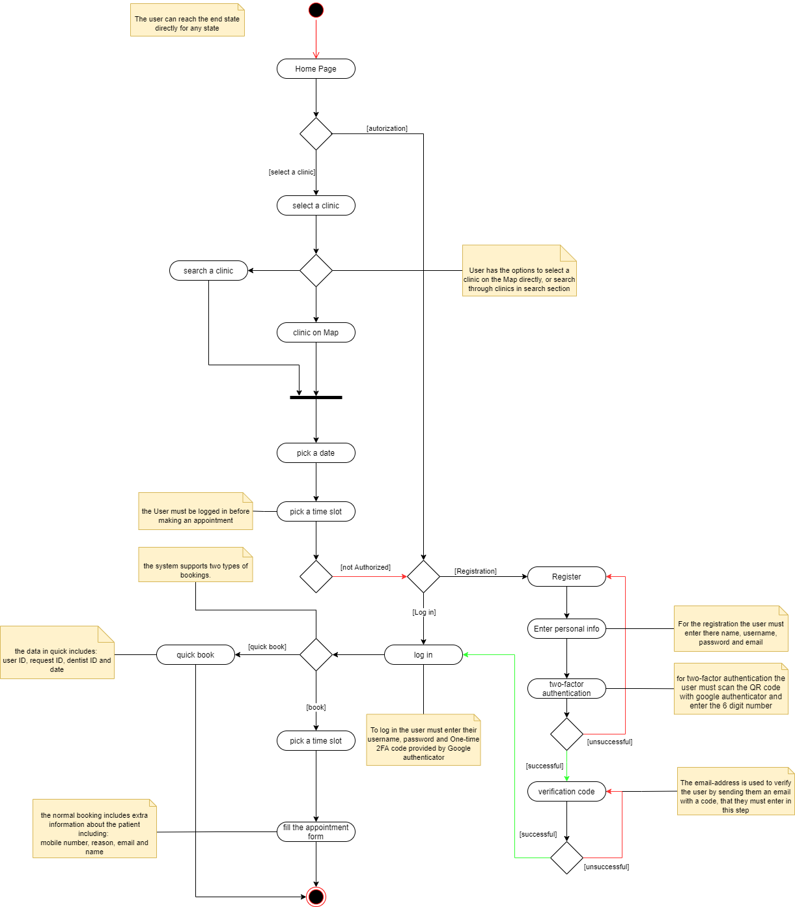
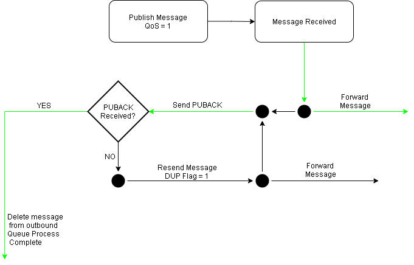

## Component descriptions and requirements

### Component diagram:

### Functional Decomposition diagram:

### Activity Diagram diagram:

### Core quality attributes:  
- Scalable  
- Secure  
- Reliable  
- Small  
- Fast  

## Intercomponent Technologies:

To communicate together, all components send messages over an MQTT virtual network, as required by the customer.  
The format for these messages is a fixed CBOR schema, detailed in [this section](#mqtt-topics), with the exception of a request/reply pair of messages using JSON since the customer provided their schema already.

> Why CBOR?

CBOR and JSON are both encodings for generic data representation.  
JSON documents can be converted to CBOR documents, and back; do note however that because the CBOR specification has more features, CBOR documents may not always be trivially convertible to JSON.
Besides extra features on the CBOR side, the only major difference is that CBOR is a binary format, while JSON is a text one.  
Since we do not normally need to inspect the packets, and whenever we do, we can simply perform the CBOR to JSON conversion, we happily make the trade of losing human-readability while gaining a smaller message overhead, and the possibility to later use the CBOR-specific features if the need for them arises.

## Frontend Components:  
  
#### **Patient client**
> What functionality do these Frontend components need to provide?

- UI that allows the user to make appointments
- The client provides users the option to view available slots in a specific dentist clinic
- The client provides both a list and a map view for registered dentist clinics in real-time
- The client allows the user to sign up and log in to see/manage their booking history

> What properties should these components strive to grow?

- User friendly
- Real-time data

> What technologies are used in the implementation of the store components?

- Vue 2
- [vuex](https://vuex.vuejs.org)
- [bootstrap-vue](https://bootstrap-vue.org) 
- [Async-mqtt](https://github.com/mqttjs/async-mqtt)  
- [Leaflet](https://leafletjs.com/)

> Why are these technologies used?  

Vue 2 is chosen for its small size, performance, flexibility and compatibility with various open source libraries. Additionally, the maintainability of the client is also improved since vue2 is one of the most well-known frameworks. This means that it has an active and dedicated community, making it easier to find solutions for future issues. Moreover, Vue's well-structured and in-depth documentation makes it easy to learn and integrate within our system. 

Vuex brought us the ability to store and share reactive data across the app without trading off performance, testability or maintainability. It empowers Vue's reactivity system and creates easily accessible data between independent components, without having to deal with complicated prop drilling. More specifically, it helps communication between the frontend and the API.

Boostrap-vue is a library of Vue components that is styled by Boostrap. There are various libraries similar to it. We used it in this project mainly because it integrates well with Vue and pro styling.

Async-mqtt, the asynchronous counterpart to mqtt.js, is the chosen library for connecting to the broker and handling the mqtt requests and response. It is chosen for its simplicity, ease of use and multiple options for customization. 

For the map, as it is the core functionality of the system, we choose Leaflet. Leaflet is an open-source JavaScript library for desktop and mobile-friendly interactive maps. It is lite, compared to most other map libraries and contains all the mapping features that that are required for this project.  

Another option on the table was the Google Map API, but it was disregarded, as it is heavy to render API with features that are not needed for this project which would have cost us speed and performance. As Leaflet is designed with simplicity, performance and usability in mind. It fits perfectly with our system and It works efficiently across all major desktop and mobile platforms, as well as it is well-documented which makes it ease to work with. 

> Reasoning for why dentist-client was removed.

In response to the first requirements update, we decided that for the team to deliver a correct product as required by the product owner, the dentist-client component had to be dropped. Prior to the update, we had assumed that dentists could make changes to the registry. This meant that we planned for the dentists to be able to view what appointments they had, a calendar view for their schedule, and other features that would not be helpful to the product owner. To remain in scope of the requirements, we decided that since the product owner updates the dentist registry, the dentist client is not required in our system. 

## Store Components:  
**Shared**  
> What functionality do these store components need to provide?

- Validate incoming data and respond if correct and saved to database, else send out error event to specific client
- Manage data resource(s) such that they do not disappear and stay consistent
- Expose MQTT api
- Consume MQTT api
- On data update sync with shards

> What properties should these components strive to grow?

- Fault tolerance
- Fast start up time
- Handle high load
- Quick request handling

> What technologies are used in the implementation of the store components?

- Implementation language: Rust 2018  
- Libraries (unexhaustive; only major ones):
  - [Tokio](https://github.com/tokio-rs/tokio) (Async runtime)
  - [Rumqttc](https://github.com/bytebeamio/rumqtt/tree/master/rumqttc) (MQTT client)
  - [Sqlx](https://github.com/launchbadge/sqlx) (SQL support, SQLite)
  - [Serde](https://github.com/serde-rs/serde) + [serde_cbor](https://github.com/pyfisch/cbor)

> Why are these technologies used?  

Rust was chosen for its speed, safety and extensive repository of quality and open source libraries made easily accessible with [Cargo](https://doc.rust-lang.org/cargo/) and [crates.io](https://crates.io/).  
Rust's borrow and lifetime checkers clearly define ownership and lifetime of resources. Combined with the [Result](https://doc.rust-lang.org/std/result/) type [idom](https://en.wikipedia.org/wiki/Result_type) helps writing safe and more importantly correct code that will not fail but handle errors visibly. The major thing with Rust is that you do not pay a lot for these safety measures, as everything is compiled to native machine code just like C++ and C do (which are known for their very negligable overhead).

Rumqttc was chosen for its native support for asynchronous functions and user friendly api design, making it easy to use. Following the Rust idiom, it has verbose errors and does not crash or lock up, instead handling problems gracefully. [Paho-mqtt](https://crates.io/crates/paho-mqtt) was also considered since it is developed by the Eclipse Foundation but was quickly shot down as it is written in C, thus bringing inherent unsafety and less idiomatic Rust.

The Tokio library was initially chosen due to it being an optional dependency of Rumqttc. It provides a tried and tested, performant multi-threaded asynchronous runtime. In combination with Rumqttc, it created a simple but effective way of dealing with MQTT messages in an intuitive way, at least compared to its synchronous counterpart.  
It was quickly discovered that Tokio would play an important part in the architecture design for the store components, and thus became a key player in massively increasing throughput and performance while staying incredibly simple.

The Sqlx and Serde libraries both leverage Rust's compiler plugin support very well, as they can automatically generate the necessary code to serialize and deserialize data structures with a single line of decorator code. This further exemplifies Rust's ability get out of your way while reducing boiler plate code with the power of macros as well as auto-generated implementations of common code. Easy (de)serialization of data structures allows for strong typing even for CBOR/JSON/SQL formats, therefore increasing fault tolerance and safety as you do not have to check if a key exists in a JSON file or likewise know that a field might be empty with [Option](https://doc.rust-lang.org/std/option/).

In addition to easy type safety, Sqlx supports a wide variety of database engines, allowing flexibility down the line, and Serde seamlessly supports both CBOR and JSON which are the two formats used in the system.

Lastly our preferred data storage method is SQLite (with Sqlx) for 3 reasons:
1. It is [fast](https://sqlite.org/speed.html) compared to other SQL implementations.
2. It does not use the client server architecture as seen by a lot of SQL implementations, thus decreasing latency and logically increasing throughput.
3. It is mature and [highly reliable](https://www.sqlite.org/hirely.html)

> Why not use a NoSQL solution?  

NoSQL databases are based on the concept of "eventual consistency" and have unrelated and unstructured data. [Eventual consistency](https://en.wikipedia.org/wiki/Eventual_consistency) and unstructured data are 2 qualities that do not mix well with this system. The trade for scalability with the price of consistency is not one which we are willing to make, as consistent booking of appointments is very important to the system. An unstructured document format is also not something that provides value to the system, as the parsing and checking of each document would introduce a lot of overhead and reduce throughput, whereas SQL has defined schemas and works well along a strongly typed language like Rust, since there is no need for type-checking of documents.

#### **User store**
The user store's main function is to manage users in the system.
Responsibilities include:
- Allow creating new users (registering)
- Respond to authentication requests (handing a users' secret to the authentication component)
- Handle user info queries (Returning the uuid for a user)

User data structure:
- id (UUIDv4)
- Username
- First name
- Last name
- Date of birth
- Secret

#### **Dentist store**
The dentist store's main function is to query the [dentist registry](https://raw.githubusercontent.com/feldob/dit355_2020/master/dentists.json) and publish new updates (if any) out to the public.

Unlike the user and appointment stores, the dentist does not use SQL in any way, shape, or form, and merely keeps a local file copy of the dentist registry, just in case, while storing the dentist registry purely in memory, as we do not own the data source and its contents can be changed at any time. With that, the architecture slightly differs as well: it still uses the blackboard style of pooling message handlers and executing those over multiple threads but also introduces a registry fetcher thread which, independently of the MQTT event loop, downloads, parses, and compares the registry every at regular intervals. This simple approach works well, as it integrates with the tokio library and does not have to scale given there is only one source to fetch.

Responsibilities include:
- Check the dentist registry every n amount of time for updates
- Publish out new updates serialized in CBOR
- Reply to requests for the dentist registry

Dentist registry data structure:
- dentists { Dentist structure, ... }

Dentist data structure:
- id
- name
- dentists
- address
- city
- coordinate { longitude, latitude}
- openinghours { monday, ... }

#### **Appointment store** 
The dentist store's main function is to manage appointments and verify incoming appointment creation requests.

Responsibilities include:
- Allow for appointment creation
- Verify dentist id and availability with the dentist store when creating a new appointment
- Reply with availability structure to availability request for a particular dentist practice

Appointment data structure:
- id
- userid
- dentistid
- date time

> Why are there two ways to book an appointment?  

In the initial requirement elicitation, the assumption was made that the booking request body can have more data fields than what was defined in the system requirement. The preliminary system architecture and design decisions were made based on the initial requirements and assumptions. One of those decisions was adding more data fields including full name, visit reason, email, and mobile number ([read full appointment structure](#Reused-structures)) to make the booking more realistic and near to an actual real-world booking. however, after the first requirement update which included a change in the booking request body, and after talking with product owners; it became clear that the booking request body must follow the format defined in requirement update.  Having a functioning booking mechanism, with extra data fields, on the client-side as well as server-side; we made the decision of implementing a new function to add support for making an appointment with the request body format defined in the project requirement. In the end, the result was quick book (without extra data fields) and normal book (with extra data fields).

#### **Custom Broker Component**  
> Why do we use a custom broker?

The MQTT protocol, which is required by the product owner(s), makes uses of a broker to dispatch all network traffic in the system.  
Given our security architectural driver, this central concentration of traffic is the prime place to put safety checks in and enforce authorizations.  
A customized broker allows us to control all the network traffic thus secure the system. 
  
> What functionality does this broker need to provide?

- Dispatch normal MQTTv3.1.1 traffic correctly
- Prevent unauthenticated access (milestone 2 only)
- Provide restricted channels for private communication
  
> What properties should this broker strive to grow?

- Fast restart time
  
> Is a purpose-build broker from the ground up needed?

No; we merely modify the behavior of an existing one through an intentional customization point.

> What technologies are used in the implementation of the broker?

- Implementation language: Haskell2010
- Base broker: [Hummingbird](https://github.com/lpeterse/haskell-hummingbird)
- Authentication mechanisms:
  * For production, time-based one-time password (TOTP); the most common client is Google Authenticator
  * For development, simple text password
- Libraries (unexhaustive; only major ones):
  * TOTP: [cryptonite](https://hackage.haskell.org/package/cryptonite)'s [Crypto.OTP](https://hackage.haskell.org/package/cryptonite/docs/Crypto-OTP.html)
  * CBOR: [cborg](https://hackage.haskell.org/package/cborg) / [serialize](https://hackage.haskell.org/package/serialise)

- Haskell authenticator module: https://hackage.haskell.org/package/mqtt-0.1.1.0/docs/Network-MQTT-Broker-Authentication.html#t:Authenticator

> Why are these technologies used?

About the broker itself... (TL; DR: Hummingbird is the most fitting broker we found for the purpose of this system)  
Our search for an adequate broker quickly led us to the [awsome-mqtt](https://github.com/hobbyquaker/awesome-mqtt) project, which has [a curated list of open-source MQTT brokers](https://github.com/hobbyquaker/awesome-mqtt#broker).
We started by filtering out brokers which did not implement websockets, since at the time of writing web clients may only perform HTTP-based networking.  
To comply with our non-functional requirement of fast restart, we then eliminated all brokers using languages that have a relatively high footprint. This ruled out interpreted languages (JavaScript, Python) as well as languages making use of a virtual machine (Java, Kotlin) brokers.  
This left us with a handful of brokers in Go, a couple in Erlang, and one in C (Eclipse Mosquitto).  
[Mosquitto](https://mosquitto.org/) was eliminated since [its authentication plugin API](https://github.com/eclipse/mosquitto/blob/master/include/mosquitto_plugin.h) heavily lacks the capability we need (in particular, the ability to set the client permissions without reimplementing a [trie](https://en.wikipedia.org/wiki/Trie) matcher ourselves).  
Erlang seemed arcane, and nobody in the team thought wise to willingly undergo the Erlang learning process.  
We now had a few brokers in Go to choose from. We never used Go, but we do partly know its language design, and it did seem fit for our use. However, Erland did catch our eye on being a functional programming language. These are widely known for their robustness and their ability to prevent bugs by forcing all codepaths from being handled, which would be of a great help achieving fault-tolerance effortlessly.  
So we went on a search for brokers in Haskell and OCaml, which are the two main general-purpose functional programming languages. The OCaml world has little in the way of an MQTT broker, let alone one that supports MQTT3.1.1, but Haskell has one fairly robust broker implementation: Hummingbird. It has support for WebSockets and TCP based MQTT connections, optionally running over TLS (Transport Layer Security), and can be used as a data source for the Prometheus statistics engine. The cherry on the cake is that it has a command-line interface which allows it to be remotely managed, thus lowering the needs for restarts altogether.  
As our most experienced backend teammate was willing to use Haskell for that task, we settled on it, and gave him the task of adding the extra features we wanted.

About authentication...  (TL; DR: simple yet secure enough without being a burden)  
We wanted something simple since it should not be a burden on the frontend nor on the users.  
Simple text passwords are simple, but they are subject to a number of attacks; keyloggers in particular.  
To combat keyloggers, the secret should rotate often, which is the very essence of TOTP.  
In order to allow easy access to our system, we use the same algorithm and parameters as used by the Google Authenticator client, since it is the one the overwhelming majority of users will probably want to use.  
There are of course other techniques for obtaining one-time passwords, such as SMS and emails, but these are much more of a burden to implement, and force users to have either a SIM card in their smartphone, or an email account.  
With these observations, we decided to use TOTP as our authentication mechanism.  
However, this is not a priority feature for the frontend as it is not part of the requirements, so for the duration of development, the authenticator should also provide plain text-based authentication to ease testing of the frontend code.

About CBOR...  
It is globally used in the system. See the [system-wide rationale](#intercomponent-technologies) for it.  
As for the specific libraries used, they simply are the most stable and well-maintained Haskell libraries for CBOR encoding and decoding.  

> What QoS level do we use?

The most suitable QoS level for our system is QoS1. QoS level 1 guarantees that a message is delivered at least once to the receiver. A message can be sent or delivered multiple times. The sender stores the message until it gets a  PUBACK packet from the receiver that acknowledges receipt of the message. The sender uses the packet identifier in each packet to match the publish packet to the corresponding PUBACK packet. If the sender does not receive a PUBACK packet in a reasonable amount of time, the sender resends the publish packet with the DUP flag.

QoS level 1 is used because every message needs to be delivered, and our system can handle duplicates. In our system, duplicate messages are not sent as the requester awaits for a response after publishing a message, knowing that it will receive a response. Aditionally, QoS level 2 is not suitable because of the overhead, and the additional time required for each message. 

