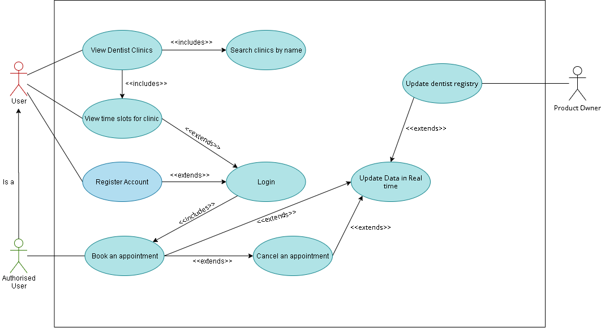

## Software Requirements Specifications

### Functional Requirements:
- FR1: The user should be able to see dentist clinics in Gothenburg on a map.  
- FR2: The user should be able to view available time slots for appointments. 
- FR3: The system shall allow a user to make an appointment.
- FR4: The system shall allow a user to cancel an appointment.
- FR5: The system should make updated data available to the whole system in realtime.
- FR6: The system should support updates to the dentist registry.
- FR7: The system should not allow users to book appointments for unavailable time slots.
- FR8: The user should be able to register an account.
- FR9: The user should be able to log in.
  
### Non-Functional Requirements:  
- NFR1: The user interface should be responsive.
- NFR2: The appointment interface should be updated without refreshing the page.
- NFR3: The application shall be easy to use for all users.
- NFR4: The user interface should show nice error messages in case of error.
- NFR5: Booking an appointment should be quick.
- NFR6: A user can search for dentists by the name of the clinic. 
- NFR7: The system should not allow unauthorised users to book an appointment.

### User Stories:
- US1: As a user, I want to be able to register, so that I can have my own personal account.  
**Acceptance Criteria**
  - There must be a user interface where the user can enter their details
  - A new user should be created in the user store
  - Proper response message if the user is registered or if they are not registered

- US2: As a user, I want to be able to login, so that I can use my own personal account.  
**Acceptance Criteria**
  - There must be a user interface where the user can enter their login credentials
  - User should exist in user store
  - User must have correct Username and TOTP code to be authorised

- US3: As a user, I want to be able to view all the dentist's clinics in Gothenburg on a map, so that I can choose which clinics I want to visit.  
**Acceptance Criteria**
  - There must be a user interface where the user can view the map
  - The map should be reactive; the user should be able to navigate around Gothenburg
  - Dentist clinics should be clearly visible to the user on the map (using pointers for example)
  - Data shown on the map should be requested from the Dentist store

- US4: As a user, I want to be able to view available time slots for a clinic, so that I can schedule an appointment at my convenience.  
**Acceptance Criteria**
  - There must be a user interface where the user can view all available time slots for a specific clinic
  - Time slots should be requested from the appointment store

- US5: As a user, I want to be able to book an appointment, so that I can be assured that I will receive dental care at the scheduled time.  
**Acceptance Criteria**
  - There must be a user interface where the user can book an appointment for an available time slot
  - Appointment should be created in appointment store
  - Time slot should be marked as *booked* in appointment store
  - There should be a confirmation that the booking was successful for the user

- US6: As a user, I want to be able to cancel an appointment, so that I can cancel an appointment if I am not available.  
**Acceptance Criteria**
  - There must be a user interface where the user can cancel an appointment, they made
  - Time slot should be marked as *available* in appointment store
  - There should be a confirmation that the booking was cancelled for the user

- US7: As a project manager, I want only authenticated users to be able to book appointments, so that the system is more secure.  
**Acceptance Criteria**
  - User should not be able to access the booking form if they are not logged in
  - User is redirected to login/register page

- US8: As a product owner, I want the system to update data in realtime, so that users cannot book appointment slots that are unavailable.  
**Acceptance Criteria**
  - Client must be subscribed to the real time topics for both the appointment store and dentist store
  - Appointment store and dentist store must publish data to the real time topics when data is updated

- US9: As a product owner, I want the system to support updates to the dentist registry, so that appointment slots are changed based on the availability of the dentists.  
**Acceptance Criteria**
  - Time slots must be updated in the user interface within ten minutes of the change
  - Time slots must be updated in the appointment store within ten minutes of the change

- US10: As a project manager, I want users to not be able to book appointments for unavailable time slots, so that the user does not have an invalid booking.  
**Acceptance Criteria**
  - Unavailable time slots should not be shown or should be highlighted in a different color to show they are not available in the user interface
  - Unavailable time slots should be marked as *booked* in the appointment store or they should not exist (if not within opening hours)

- US11: As a user, I want to be able to search for clinics by name, so that it is faster and easier for me to make an appointment.  
**Acceptance Criteria**
  - There must be a user interface where the user can search for clinics
  - Accurate results are returned for the search
  - Clinics not shown in the results of the search are hidden on the map

### Use Case Diagram

