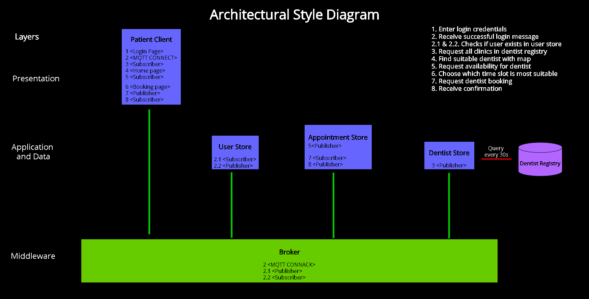
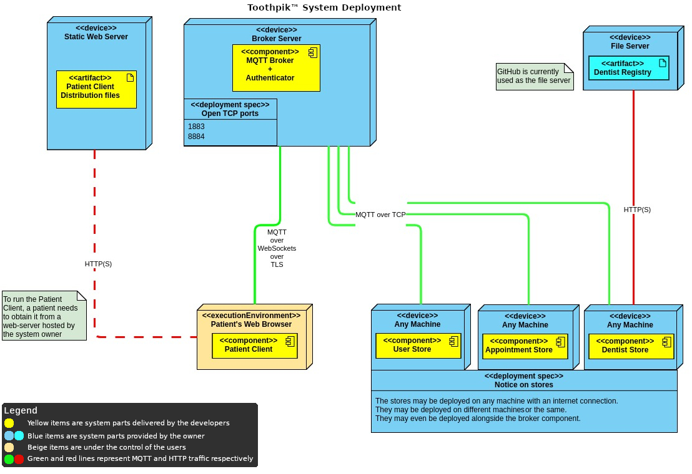
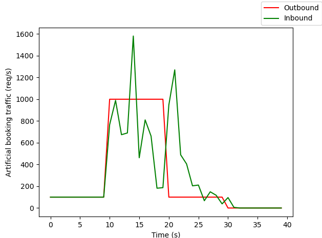
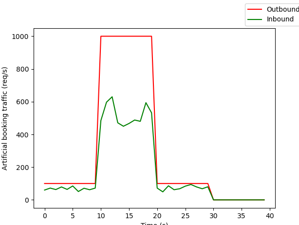

## Software Architecture Design
_The styles driving the system structure_

The Toothpik system architecture revolves around two core drivers: security and availability

These drivers' expectations are met through the application of two architectural styles.
Since we have real-time events to be propagated to all the user interfaces (say, a booking has been made therefore a time slot has become unavailable for a specific dentist), and there is a course requirement to use MQTT as the underlying transport protocol, the Publish/Subscribe architectural style is quite fitting, therefore we selected it.
At the same time, we wish to keep a clear frontend/backend separation to better identify the security clearance of each component, so we picked Client/Server as our second style.

In practice, security is accomplished by taking advantage of the traffic bottleneck that is the broker and integrating all safety checks (authentication and ACLs) into it, while availability is taken care of by allowing the system to be deployed with as many instances of the clients and stores as needed.

We decided that two main architectural styles would be best suited for Toothpik: Client/Server and Publish/Subscribe. Client/Server suits our application because we can split the implementation into three tiers, the presentation tier (client), the logic tier (broker and stores), and the data tier (stores). Additionally, because security and availability are our main architectural drivers, we have a thin client. This means the network load is low, the security is concentrated at the server, and the system is robust since it has easy fault recovery. 

Publish/subscribe suits our application because we use real-time events to update data on the client side. This is because there is frequent production of data, that is, the PO can update the Dentist Registry at any time. Additionally, the users are interested in the updates because they need to be able to view what booking slots are available for a given clinic, so that they can accurately book an appointment. The updates need to be in real time because multiple users can book appointments at the same time, therefore appointment slots that are booked by one user should not be available for a different user.  

### Combined Software Architecture Diagram

### Intended deployment

### *Store architecture
The store components run on the principles of performance and simplicity for the developer.
When you get 20 incoming messages, their respective handler functions get called and get moved onto a pool of jobs to be done, but only run once they get scheduled and started by the tokio runtime (see [here](Components.md)) on an available computing thread. This allows for great scalability and simplicity as this creates a sort of internal buffer of messages to be handled, which is great for throughput as this blackboard architecture prevents blocking the event loop by delegating any heavy computations to different computing threads.

> Why not use simple a simple queue on a different thread to handle incoming messages?
  
It can be argued that a queue could be setup to buffer incoming requests and handle them on different threads, while this works it does not scale well unless you develop a framework that schedules messages onto different queues on different threads to truly scale over all available CPU cores; this is exactly what Tokio already does: it schedules asynchronous functions over multiple threads. The key here is that the function arguments (MQTT packet data in our case) passed at the call site stay with the function as long as the function exists. Not considering the technical debt such a custom framework would bring using asynchronous functions like this reduce the mental capacity needed to understand what's going on as this model closely resembles synchronous programming from the perspective of the developer.

### Fault tolerance
Our system doesn't ship a dedicated fault tolerance component, but rather employs a simple but powerful mechanism embedded in the backend components themselves to keep load under control. This integrated design allows for more fine grained control and introduces almost no overhead compared to a complicated system where a backend component would apply back pressure to communicate capacity for example. As stated above the design of handling incoming messages is buffered and multi-threaded, this is the first step in being fault tolerant. Here is a graph that clearly shows how the buffer works in action:
  
As you can see sudden heavy load gets absorbed by the buffer, at 17s it struggles a lot, at 20s the sudden load stops, and seconds later all buffered messages get handled and normal operation continues.  

This graph shows a flaw in the buffered system, latency gets a hit as more and more messages are waiting to be handled. That brings us to the second step of fault tolerance in our system. rate limiting. The integrated rate limiter counts how many messages are currently buffered and limits any new messages to be buffered above a configurable threshold. This ensures that the buffer stays small enough to guarantee good latency and reduces memory consumption.
  
_\* threshold set aggressively to increase the effect for demo purposes_
As seen in this graph you can see that at a certain load the rate limiter kick in and block any more messages to be handled and clearly shows low latency response.  
This buffering combined with rate limiting makes the system very fault tolerant and resistent to high loads.
  
